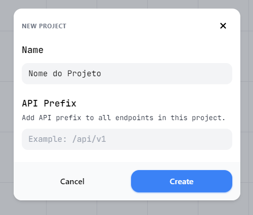
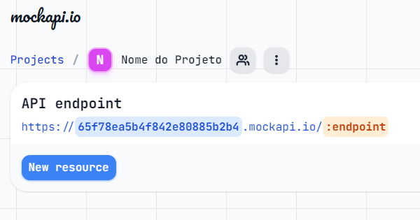
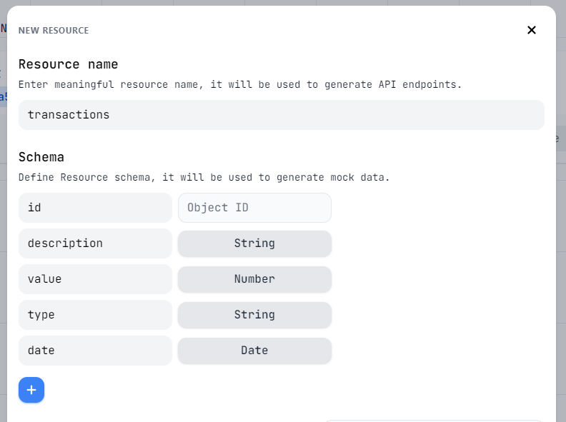
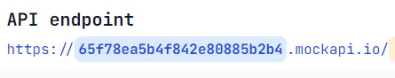

<h1 align="center" style="font-weight: bold;">Desafio proposto pela Oxeanbits 👨🏻‍💻</h1>


<p align="center">
 <a href="#requirements">Requisitos</a> • 
 <a href="#tech">Tecnologias utilizadas</a> • 
 <a href="#runapp">Como rodar a aplicação</a> • 
 <a href="#runtests">Como rodar os testes</a> • 
</p>

<h2 id="requirements">Requisitos</h2>

- Criar um projeto utilizando React;
- Escolher uma API para consumir dados fictícios;
- Utilizar os componentes do Kendo UI (pelo menos o de Grid);
- Fazer as colunas do Grid serem filtráveis;
- Fazer que aplicação seja responsiva;
- Implementar testes unitários utilizando o Jest para pelo menos uma funcionalidade crítica da aplicação;
- Escrever um README.md com instruções para executar o projeto, configurar variáveis de ambiente e rodar os testes.

<h2 id="tech">Tecnologias utilizadas</h2>

### Client:

Utilizei [React JS](https://react.dev/) em conjunto com a lib [Kendo UI]("https://www.telerik.com/kendo-react-ui/components/introduction/") para construir a interface da aplicação.

### API

Para simular o consumo de dados em uma API externa com dados personalizados, utilizei o [Mock API]("https://mockapi.io/").

<h2 id="runapp">🚀 Como rodar a aplicação</h2>

<h4> Pré-requisitos</h4>

- Node
- Git

<h4>Instalar projeto</h4>

```bash
git clone https://github.com/luccarauedys/oxeanbits-desafio.git
npm install
```

<h4>Variáveis de ambiente</h4>

Na raiz do projeto, crie um arquivo `.env` com as chaves e valores localizados em `.env.example`

Para isso, você pode criar uma conta em [Mock API]("https://mockapi.io/projects"), e depois:

- Criar um novo projeto



- Criar um novo recurso



- Definir o schema do recurso



- Copiar a URL da API e colar no arquivo `.env` como `REACT_APP_API_URL`



<h4>Rodar aplicação</h4>

```bash
npm start
```

<h2 id="runtests">👩‍💻 Como rodar os testes</h2>

```bash
npm run test
```
